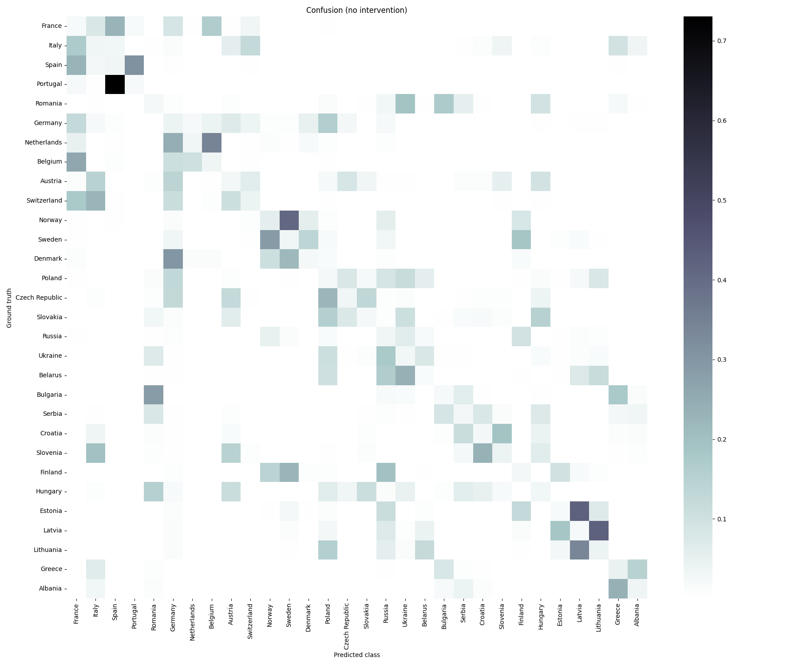
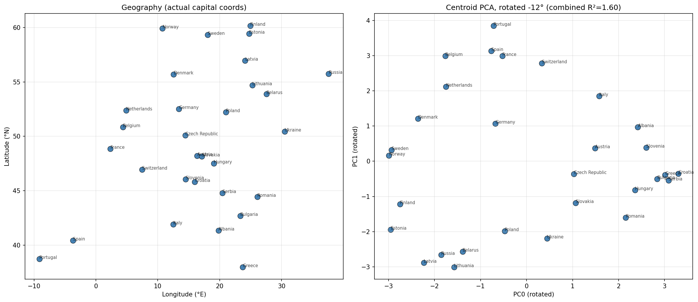
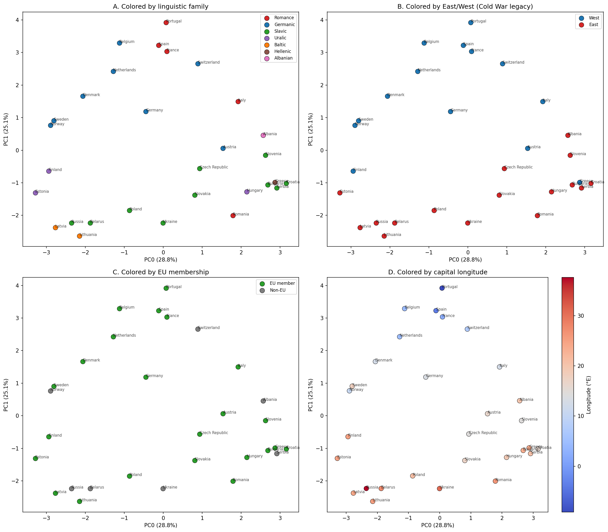
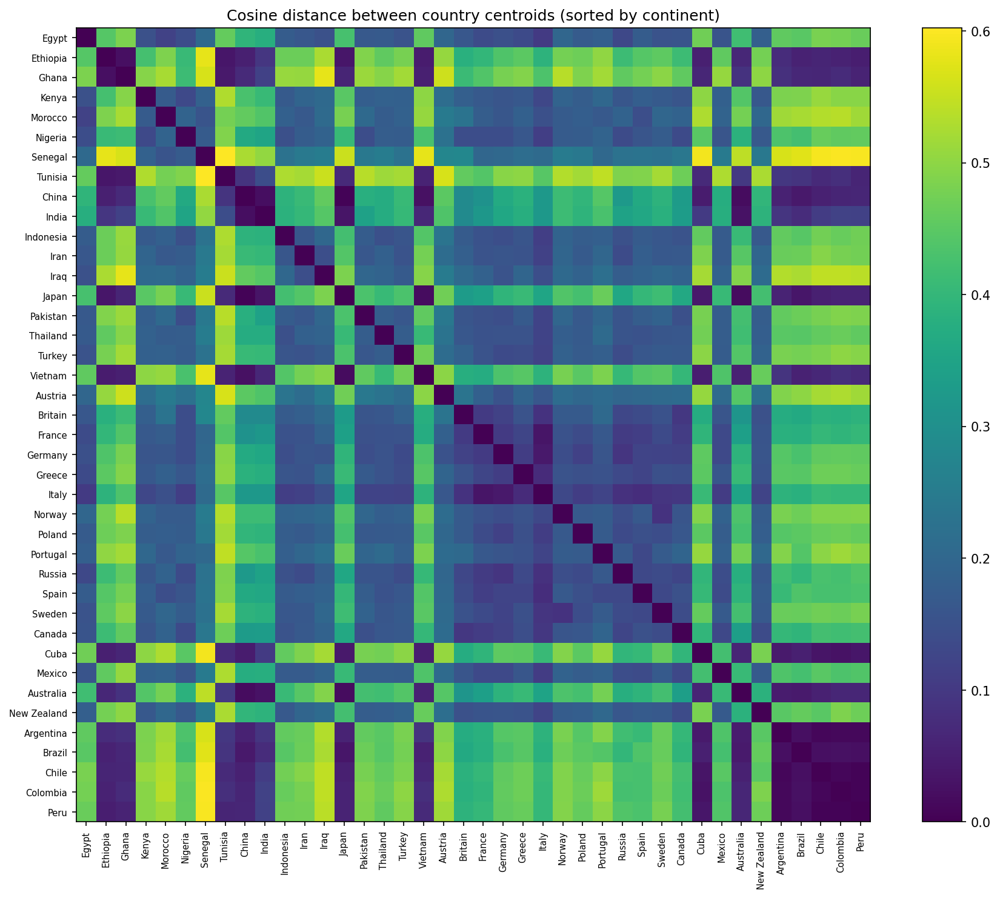
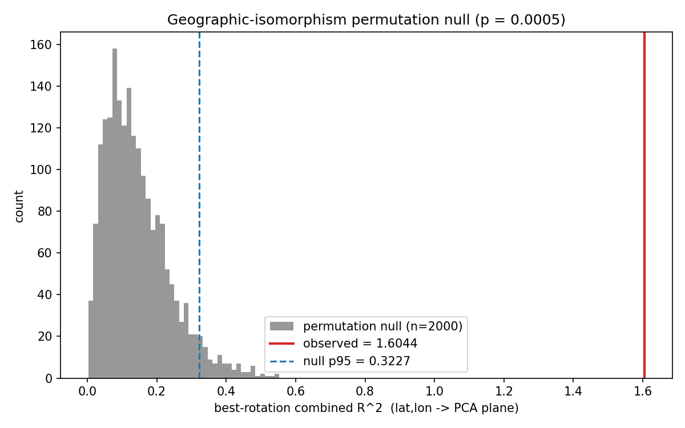

# Experiment Report — 2026-05-13--nationality-geometry--clever-falcon

> Auto-generated by `/interpret-experiment` on 2026-05-15. Read alongside `README.md` and the executed notebook `result/country_borders_geometry.ipynb`. This session has no `plan/RESEARCH_OBJECTIVE.md` / `plan/PLAN.md` (it was scaffolded via `/setup-task`, not `/plan-experiment`); the objective and hypotheses below are lifted from the session `README.md` and the notebook design. See §9. **Phase-1 robustness checks (permutation null, bootstrap CI, geography-residual probe) folded in 2026-05-15 — see §6.3.**

## 1. Objective

Probe whether Llama-3.1-8B internally represents European country geometry as a coherent map — i.e. whether per-answer-country centroids on a directional border task ("Which country lies to the east of Spain?") form a representation isomorphic to the lat/lon layout of Europe, rather than encoding language family, Cold-War division, or EU membership.

## 2. Headline finding

**Llama-3.1-8B encodes European country relations as a single, globally coherent ~2-D geographic map.** Regressing capital (latitude, longitude) onto the per-answer-country centroid PCs yields PC0 R² = 0.77 loading almost purely on latitude and PC1 R² = 0.83 loading almost purely on longitude, with near-zero off-axis coefficients and a best-fit in-plane rotation of only −11.7° (combined R² = 1.604 ≈ raw PC0+PC1 sum) — PCA recovers the geographic frame natively (`result/country_borders_geometry.ipynb`, geographic-isomorphism cell). **This alignment is strongly significant: a 2000-permutation null over country↔coordinate assignments never reaches it (p = 0.0005; null max 0.55 vs observed 1.60), and the bootstrap 95% CI [1.24, 1.80] sits entirely above the null (`result/geometry_robustness.json`).** Bordering-country pairs are 2–10× closer than the global median cosine distance while unrelated distant pairs are farther. Every non-geographic axis fails to survive controls: EU membership is not decodable at all (probe lift −0.10), and the Cold-War East/West and linguistic-family signals collapse to chance once geography is partialled out (§6.3). The representation is *specifically* geographic. (And it is a property of the *relational answer* representation: §6.4–§6.5 show the direct entity-token readout is far weaker at *every* layer, so the map is produced by the relational computation, not read from a stored entity coordinate — a mechanistic claim about this task, not a denial of a stored world-map elsewhere.)

## 3. Verdict against success criteria

*(No `plan/RESEARCH_OBJECTIVE.md` exists, so no formal success criteria were declared. The de-facto criterion implied by the session README — "geography wins if (lat,lon)→PCA R² is high AND neighbor pairs are closer than median AND the scatter resembles Europe" — is evaluated below.)*

| Criterion | Result | Evidence |
|---|---|---|
| Geographic isomorphism: (lat,lon) → centroid plane R² high | met (significant) | combined R² = 1.604 / 2.0 (PC0 0.77 / PC1 0.83); permutation p = 0.0005, bootstrap 95% CI [1.24, 1.80] vs null max 0.55 — `result/geometry_robustness.json`, `result/country_borders_geometry.ipynb` |
| Bordering pairs closer than global median cosine distance | met | all 8 `geo_neighbor` + 4 `fam+geo` pairs 2–10× below median 0.076; controls above — notebook pair-probe cell |
| Rotated PCA scatter visually resembles Europe | met (mirror-flipped) | `result/figures/pca_vs_geography.png`; orientation arbitrary, R² sign-invariant |

## 4. Verdict against hypotheses

*(Hypotheses are the four competing axes from the session README / notebook design.)*

| Hypothesis | Outcome | Evidence |
|---|---|---|
| **H1 Geography** — centroids form a coherent lat/lon map | **confirmed (significant)** | PC0≈lat R²0.77, PC1≈lon R²0.83, native −11.7° alignment; permutation p = 0.0005, bootstrap CI [1.24, 1.80] clears null max 0.55 — `result/geometry_robustness.json` |
| **H2 Cold-War East/West** — split overrides geometry | **falsified as independent axis (measured)** | linear-probe lift +0.30 collapses to **+0.00** (residual acc 0.533 = chance) after partialling (lat,lon) out of the centroids — `result/geometry_robustness.json`; all cross-curtain border pairs (DE–PL, AT–HU, FI–RU, NO–RU, GR–BG) also come out *close* |
| **H3 Linguistic family** — overrides geometry | **falsified — no signal independent of geography (measured)** | raw probe lift only +0.14, **collapses to −0.04 (below chance)** once geography is partialled out (`result/geometry_robustness.json`); within/between 1.54 and clustered non-adjacent same-family pairs are geographic shadows |
| **H4 EU membership** — encoded as a political bloc | **falsified (clean null)** | within/between ratio 0.95 (≈1, no clustering); probe lift −0.10 (worse than majority class) — notebook within/between & probe cells |

## 5. What ran

- **Task / model / variant**: `country_borders` (30 European countries × 8 directions × 4 paraphrase templates → 960 enumerated prompts, 584 geographically valid) on `meta-llama/Llama-3.1-8B`, seed 42, `enumerate_all: true`, `n_train: 1000`, `n_test: 50` (`artifacts/country_borders/llama31_8b/baseline/metadata.json`).
- **Sweep axes**: none.
- **Shipped analyses used**:
  - `baseline` — completed; full artifacts present locally (`artifacts/country_borders/llama31_8b/baseline/`).
  - `locate` (interchange) — **partial**: per-layer feature tensors extracted at L0/8/12/16/20/24/28 (`artifacts/country_borders/llama31_8b/locate/interchange/country/features/`) but no `results.json` / `heatmap.png` — the interchange scoring step did not produce a layer sweep. Layer 28 was used as a carry-forward for subspace, not selected by a locate maximum.
  - `subspace` (`pca_k32`, variable `country`) — ran on the remote GPU (RunPod); raw feature/visualization artifacts were intentionally not transported (733 MB excluded). Its numbers are sourced from the executed notebook's embedded cell outputs.
- **Session-local analyses / methods**: `code/analyses/geometry_robustness.py` (Phase-1: permutation null + bootstrap CI + geography-residual probe; see §6.3). The primary geometry analysis (centroid construction, lat/lon regression, within/between ratios, LOO probes, pair probes) is implemented inline in `result/country_borders_geometry.ipynb` rather than as a scaffolded module.
- **Diff vs. planned tree**: no `plan/PLAN.md` to diff against (gap noted in §9). Relative to the notebook's own pipeline, all sections ran except locate's interchange scoring.

## 6. Per-analysis findings

### 6.1 baseline

- **Research question**: Does the model actually solve the directional-border task well enough for its centroids to carry signal?
- **Key numbers**: strict accuracy **380 / 584 = 65%** on geographically valid prompts. Raw `accuracy.json` reports 380/960 = 39.6% and `prob_accuracy` 0.188, but 376 of the 960 enumerated cells are structurally empty (no valid neighbor in the 30-country set) and can never match — so the 40% figure is not the model's real accuracy. Counterfactual sanity (`baseline/counterfactual_sanity.json`): `change_country` proportion 0.969 and `random` 0.906 (country is a strong causal lever); `change_direction` 0.0 and `change_template` 0.0 — template-invariance is expected and correct, but the direction input is **not** cleanly isolated by the sanity sampler (consistent with the moderate accuracy and many direction-counterfactuals landing on invalid cells).
- 
- **Interpretation**: 65% on valid prompts with ~20 examples per answer-country centroid is enough signal for geometry, while the weak isolated effect of `direction` foreshadows that the learned structure is dominated by country *position* rather than crisp directional computation.
- **Artifacts**: `artifacts/country_borders/llama31_8b/baseline/`

### 6.2 subspace + geometry (per-answer-country centroids)

- **Research question**: Do per-answer-country centroids form a representation isomorphic to the geographic layout of Europe, and is any non-geographic axis (language / Cold-War / EU) independently encoded?
- **Key numbers** (from `result/country_borders_geometry.ipynb`):
  - Geographic isomorphism: PC0 R² 0.772 (β_lat −0.30, β_lon ≈0.05); PC1 R² 0.832 (β_lon −0.18, β_lat ≈0.02); PC2 R² 0.070; best rotation −11.7°, combined R² 1.604.
  - Pair probes (global median cosine 0.076): neighbor pairs e.g. CZ–SK 0.006, RU–BY 0.007, NO–SE 0.009, FR–DE 0.020 — all 12 neighbor/fam+geo pairs well below median; controls (PT–FI, NO–GR, ES–RU) above.
  - Within/between cosine ratio: linguistic_family 1.54, east_west 1.36, eu_member 0.95.
  - LOO linear probe lift: linguistic_family +0.14 (acc 0.50 / chance 0.36); east_west +0.30 (acc 0.83); eu_member −0.10 (acc 0.67 / chance 0.77).
- 
- 
- 
- **Interpretation**: The representation is specifically a 2-D geographic map: latitude and longitude are recovered as separate, near-orthogonal, near-natively-aligned PCs; local adjacency composes into that global frame. The linguistic and Cold-War signals visible in the raw probes are *not* independent codes — §6.3 measures both away to chance once geography is partialled out — and the only geographically-incoherent political grouping (EU) is absent.
- **Artifacts**: subspace raw outputs on the remote GPU (not transported); numbers embedded in `result/country_borders_geometry.ipynb`; figures in `result/figures/`.

### 6.3 geometry robustness — Phase-1 (`code/analyses/geometry_robustness.py`)

- **Research question**: Is the geographic-isomorphism R² significant given only 30 centroid points, and are the East/West and linguistic-family signals independent of geography?
- **Key numbers** (`result/geometry_robustness.json`):
  - **Permutation null** (2000 shuffles of country↔coordinate assignment): observed combined R² 1.6044; p = 0.0005 (no permutation reached it); null mean 0.143, p95 0.323, max 0.553.
  - **Bootstrap** (2000 country resamples): 95% CI [1.240, 1.805], median 1.612 — the lower bound is ~2× the null max.
  - **Geography-residual probe** (linearly remove (lat,lon) from the 32-d centroids, re-run LOO logistic probe): East/West +0.30 → **+0.00** (residual acc 0.533 = chance 0.533); linguistic family +0.14 → **−0.04** (residual acc 0.321 < chance 0.357).
- 
- **Interpretation**: The map is statistically robust, not an artifact of few points — observed R² lies entirely outside the null and the bootstrap CI never enters it. The residual probe converts §6.2's hedged claims into measurements: East/West is *exactly* longitude relabeled (lift drops to precisely chance) and linguistic family carries *zero* signal independent of geography (drops below chance). Both apparent secondary axes are geographic shadows.
- **Artifacts**: `result/geometry_robustness.json`, `result/figures/geometry_null_hist.png` (computed on RunPod against the subspace features, transported back via the lightweight git path).

### 6.4 retrieval vs. computation — #2 (`code/analyses/retrieval_vs_computation.py`)

- **Research question**: Is the coherent Europe map a property of the *stored* entity representation (Gurnee & Tegmark-style direct readout) or of the *relational computation's* output? Within-task controlled contrast — identical prompts / model / layer 28 / PCA-32, differing only in read position: last-token answer (relational, aggregated by answer country) vs. country entity token (direct, grouped by named country).
- **Key numbers** (`result/retrieval_vs_computation.json`):
  - Relational (computed): combined R² 1.604/2.0 (PC0≈lat 0.77, PC1≈lon 0.83); permutation p = 0.0005; CI [1.24, 1.80].
  - Direct (stored, entity token @ L28): combined R² **0.546**/2.0, **PC0 R² = 0.00** (no geographic content in the dominant axis; weak signal only in PC1 0.55 / PC2 0.48); p = 0.003 but bootstrap CI [0.31, 1.32] very wide.
  - Same map? Procrustes over 30 shared countries: disparity **0.89** (≈ maximally dissimilar), aligned-coord r **0.33** — the two geometries are largely distinct.
- 
- **Interpretation**: At layer 28 the coherent map lives at the relational answer position and is largely absent / a different geometry at the entity-token position. The fixed-layer confound this raised is **resolved by the layer sweep (§6.5)**: the relational map is strong at *every* layer while the direct readout is weak at *every* layer.
- **Artifacts**: `result/retrieval_vs_computation.json`, `result/figures/retrieval_vs_computation.png`.

### 6.5 layer-sweep control — resolves the §6.4 confound (`code/analyses/layer_sweep.py`)

- **Research question**: Is §6.4's relational≫direct gap an artefact of pinning layer 28, or does it hold at every layer? Single-cell subspace at layers {4,8,12,16,20,24,28,31} × {answer (relational), entity-token (direct)}, identical featurisation; combined (lat,lon)→PCA R² per cell.
- **Key numbers** (`result/layer_sweep.json`):
  - Relational: R² **1.13–1.67** across all layers (L4 1.52, L8 1.51, L12 1.16, L16 1.13, L20 1.61, L24 1.58, L28 1.60, L31 1.67); all p ≤ 0.002.
  - Direct: R² **0.36–0.59** across all layers (gentle rise to L31 0.59), hugging the n=30 null ceiling (~0.55); L16 not significant (p = 0.05).
  - Best-vs-best: relational **1.67** (L31) vs direct **0.59** (L31). Relational exceeds direct by >1.0 at **every** layer.
- 
- **Interpretation**: The §6.4 confound is refuted — there is no layer at which the entity-token representation carries the clean Europe map, while the relational-answer representation carries it at all layers. **Mechanistic claim (defensible):** for relational geographic queries the model does not linearly read a stored coordinate at the entity token; the coherent map is a property of the *computed answer* representation. This is *not* a claim that Llama lacks a stored world-map — Gurnee & Tegmark (arXiv 2310.02207) show it has one under their setup; this is the complementary, task-specific mechanism. Sweep used n_perm=500 (p floor 0.002); the canonical L28 relational cell is independently confirmed at n_perm=2000 (p=0.0005, §6.3).
- **Artifacts**: `result/layer_sweep.json`, `result/figures/layer_sweep.png`.

### 6.6 chord steering — causal test of the metric map (`code/analyses/chord_betweenness.py`, `chord_steering.py`)

- **Research question**: §6.2–§6.5 establish the Europe map *correlationally* — it is decodable from the relational-answer representation. Is it also *causally metric*: (Stage A) for a country B geographically between far A and C, does cᴮ lie on the chord cᴬ→cᶜ; and (Stage B) if we interpolate the relational answer-state from a prompt answering A toward one answering C, does B transiently become the model's answer at the midpoint (the user-posed "drive through the country in the middle" test)?
- **Key numbers**:
  - **Stage A (geometric pre-check, `chord_betweenness.json`)**: B sits near the A→C chord — correlation(t_geo, t_act) **+0.576** in the lat/lon plane and **+0.696** in the full 32-d space, both permutation p = 0.0005; between-vs-off chord residuals cleanly separated (plane 0.203 vs 0.751; full 0.568 vs 0.852). The map is **approximately locally metric** — a correlational geometric fact, motivating the causal test.
  - **Stage B (causal interchange, `chord_steering.json`)**: framework-native interpolation `new_act = inv_feat((1-α)·f_base + α·f_src)` at `last_token`, 5 curated near-collinear far triples, α∈{0,1}. The §6.3 PCA-32 subspace interchange does not move the answer (P_C@α=1 ≤ ~0.04 at L28, P_A stays dominant). The **full-residual** transplant, swept over **L20/24/28/30/31**, also never flips it: max P_C@α=1 = **0.074** (Belgium→Lithuania, L31) vs P_A = 0.51 there; P_A erodes ≤0.20 from baseline at every layer; P_C rises monotonically with depth but stays ~7–40× below P_A; P(B) never emerges (flat at its base rate; Germany even declines).
- 
- **Interpretation**: Stage A confirms the map is geometrically metric *as a cached representation*. Stage B shows that property is **not causally exploitable at the last-token position at any depth**: even a 100% transplant of the entire last-token residual at layer 31 — one block from the unembed — cannot redirect the answer. The monotone rise of P_C with hook depth is the fingerprint of **attention reconstruction**: the layer hook leaves ≥1 attention block downstream which, at the last position, re-reads the un-swapped *question* tokens and rebuilds answer A. The relational answer is therefore **position-distributed and attention-reconstructed from the question tokens, not carried by the last-token residual** — a direct, depth-resolved instance of the decodable-≠-causal gap. The betweenness/steering ("B at the midpoint") hypothesis is **not testable at last_token**; it requires interchanging the question-defining (country/direction) token positions. Net: the §6.2–§6.5 geometry claim stands as a *readout* result and is now precisely bounded — the map is decodable, not the causal substrate of the answer token.
- **Artifacts**: `result/chord_betweenness.json` (Stage A); `result/chord_steering.json` + `result/figures/chord_steering_L*.png` (Stage B, layer-swept full-residual anchor); `code/analyses/chord_betweenness.py`, `code/analyses/chord_steering.py`. Computed on RunPod, transported via the lightweight git path.

## 7. Paper comparison

*(not a replication session)*

## 8. Cross-run / cross-session comparison

*(Not triggered — no sweep, no declared cross-session reuse. An archived capital-retrieval lineage exists under `artifacts/_archived_nationality_capitals/`, but it was a deliberately abandoned approach and the session explicitly does not benchmark against it; no comparison is drawn.)*

## 9. Caveats & open questions

- **No formal plan artifacts**: `plan/RESEARCH_OBJECTIVE.md` and `plan/PLAN.md` were never created (session used `/setup-task`); objective, success criteria, and hypotheses here are reconstructed from `README.md` and the notebook design. No `run/<runner>_resolved.yaml` exists — the runs were notebook-driven; run parameters are taken from `artifacts/.../baseline/metadata.json`.
- **Subspace artifacts not local**: the 733 MB of activations/features remained on the RunPod GPU and were intentionally excluded from transport. The §6.2 geometry numbers are sourced from the *executed notebook's embedded outputs*; the §6.3 robustness numbers are the one re-loaded artifact (`geometry_robustness.json`, recomputed on RunPod against the same features). Full re-derivation requires a box with the subspace features.
- **Layer choice resolved**: §6.5 swept layers 4–31; the relational map is strong (R² 1.13–1.67) at *all* of them, so the layer-28 carry-forward is representative, not cherry-picked. (The shipped `locate` interchange scoring/heatmap was still never produced, but the layer sweep subsumes its purpose here.)
- **Small but now-quantified point count**: 30 centroids / 2 regressors. Resolved in §6.3 — permutation p = 0.0005 and bootstrap 95% CI [1.24, 1.80] both clear the null by a wide margin. The bootstrap CI is moderately wide (~0.56 span), reflecting the small country set; a larger country set would tighten it. Capital coordinates remain a country-position proxy.
- **Direction not cleanly isolated** (`counterfactual_sanity.json`): the directional input is a weak causal lever in the sanity check — the manifold may encode country position more than the border *relation* per se. Open question; partially informed by §6.4–§6.5.
- Single model (Llama-3.1-8B); single task. The layer caveat is resolved (§6.5). The `direct` condition is the entity token *within border prompts*, not a Gurnee-&-Tegmark diverse-prompt probe — so §6.5 bounds the mechanism for this task, not the model's stored world-map in general.
- **Map decodable, causal traversability open** (§6.6): the geometry result is a *readout* claim. Stage A shows the manifold is metric as a cached representation, but the last-token interchange (full-residual, L20–L31) cannot redirect the answer — the answer is attention-reconstructed from the question tokens. Whether the metric map is *causally traversable* at the implicated `country`-token site remains untested: that probe is degenerate on `country_borders` (§10), so the steering hypothesis is bounded-negative at last_token and open elsewhere, pending a relationally-richer task.

## 10. Suggested next steps

- **(DONE — §6.5)** The layer-sweep control resolved the §6.4 confound: relational ≫ direct at every layer. The "map produced by the relational computation, not an entity-token readout" claim is supported and publishable with the precise framing in §6.5. Remaining steps strengthen and disseminate it:
- **(CONCLUDED — §6.6)** Causal test of the recovered map: Stage A confirmed the manifold is geometrically metric (chord betweenness, p = 0.0005); Stage B's last-token interchange — swept full-residual L20–L31 — established a *bounded negative*: the map is decodable but not causally exploitable at last_token at any depth (the answer is attention-reconstructed from the question tokens). The steering line is **concluded here** — §6.6 is the citeable result. The implicated relocation site was evaluated and found degenerate on this task, not pursued (next bullet).
- **Closed path — question-token interchange (evaluated, not pursued)**: relocating the intervention to the `country` token was assessed against the actual task data. The relational-neighbor readout is degenerate — for the Stage-A triples only 0–3 of 8 directions yield three distinct existing neighbors (Portugal→Slovakia→Russia: **zero**), and the readout countries are geometrically arbitrary, so a P(nB) peak would signal only "the answer changed" (already shown in §6.6), not betweenness. The alternative — decoding the steered entity token directly — leans on the entity-token map that §6.5 measured as *weak* (R² 0.36–0.59), risking an inconclusive result. Net judgement: further steering work has poor signal-to-noise on `country_borders`; testing the betweenness hypothesis cleanly needs a different task with a denser/relationally-richer neighbor structure, not more interventions here.
- **Promote to a reusable module**: `code/analyses/geometry_robustness.py` is the seed; fold the notebook's centroid/regression/probe pipeline in beside it and lift the whole thing into a session-local (then shipped) causalab analysis.
- **Generalize**: repeat on a second base model of similar scale to test whether the coherent-Europe-map result is model-specific.

## 11. Provenance

- Plan: *(absent — `plan/RESEARCH_OBJECTIVE.md`, `plan/PLAN.md` not created; objective from `README.md`)*
- Paper context (replication only): *(not a replication session)*
- Resolved config: *(absent — runs were notebook-driven; params from `artifacts/country_borders/llama31_8b/baseline/metadata.json`)*
- Run log: `run/baseline_rerun.log`, `run/llama31_8b_validation.log`
- Geometry numbers source: `result/country_borders_geometry.ipynb` (§6.2); `result/geometry_robustness.json` + `code/analyses/geometry_robustness.py` (§6.3); `result/retrieval_vs_computation.json` + `code/analyses/retrieval_vs_computation.py` (§6.4); `result/layer_sweep.json` + `code/analyses/layer_sweep.py` + `layer_sweep_driver.sh` (§6.5)
- Cross-session references: none
